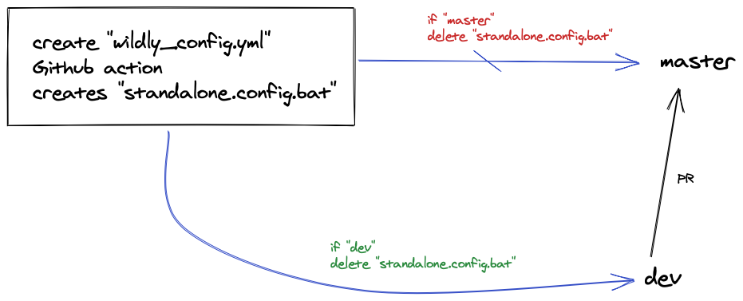

# Github Actions

## Important Links

- [Freecodecamp - What are Github Actions](https://www.freecodecamp.org/news/what-are-github-actions-and-how-can-you-automate-tests-and-slack-notifications/)
- [Linkedin Learning - Automating with Github Actions](https://www.linkedin.com/learning/learning-github-actions-2/automating-with-github-actions-2)
- [Github Marketplace - Using Add & Commit](https://github.com/marketplace/actions/add-commit)
- [Github Marketplace](https://github.com/marketplace)
- [My own - Github actions sandbox repo](https://github.com/avj2352/github-actions-essential)


## What are Github Actions ?

[Actions](https://github.com/features/actions) are a relatively new feature to [Github](https://github.com/) that allow you to set up CI/CD workflows using a configuration file right in your Github repo.

Previously, if you wanted to set up any kind of automation with tests, builds, or deployments, you would have to look to services like - Jenkins Automation tool, [Circle CI](https://circleci.com/) and [Travis](https://travis-ci.org/) or write your own scripts. But with Actions, you have first class support to powerful tooling to automate your workflow.


## Use-cases

- Automate Unit Tests
- Automate Build Pipelines
- Code Formatting
- Remote Deployments
- CI / CD
- Event based triggers


## How are they different from Jenkins ?

- **Jenkins** creates workflows using Declarative Pipelines, which are similar to **GitHub Actions** workflow files. 
- **Jenkins** uses stages to run a collection of steps, 
- **GitHub Actions** uses jobs to group one **or** more steps **or** individual commands. 
- both **Jenkins** and **GitHub Actions** support container-based builds.


## Pros & Cons

### Pros

- Built in Support into Github
- Free to use* -  (also contains premium pipelines Circle CI & Travis are premium) but simple deployment scripts are free to use
- Supports both CI & CD
- Huge Market place - [Github Marketplace](https://github.com/marketplace)
- Platform Agnostic - but supports a wide variety of Languages - 
- Built in Container - Docker
- Can build your own custom pipelines and contribute to the community

### Cons

- They keep _"upgrading"_ and changing shit up
- Has a bit of a steep learning curve
- YAML !! :thinking:
- BOILERPLATE. Most of the time, It's just a copy paste :smile:
- Some errors are harder to debug


## For Online Sales - Mid-Tier

Right now, we have multiple repos which require different **Wildfly Configuration**, with most containing **sensitive credentials**. While we can store these configuration directly in the Git repo. These can be considered as a **security risk**


### What if we use Github actions to store ONLY under certain branches ?

I propose to use the following 2 nice features of Github Actions

1. Storing these Wildfly Configuration in the repo ONLY under certain branches
2. Using Github Secrets to Obfiscate sensitive information


### 1. Storing these Wildfly Configuration in the repo ONLY under certain branches

Github actions can be TARGETTED to run for either -

- Git Push actions
- Pull Requests

They can also be TARGETTED to run for certain branches - For Eg: `dev`

The following YAML script, creates a Custom file `env.txt` under the folder - build/env.txt

```yml
name: Create custom file
on: push

jobs:
  run:
    name: Create custom file
    runs-on: ubuntu-latest
    steps:
      - name: Checkout repo
        uses: actions/checkout@v2

      - name: Create file
        run: |
          cat <<EOT >> build/env.txt
          line 1
          line 2
          EOT
      - name: Commit changes
        uses: EndBug/add-and-commit@v7
        with:
          author_name: Pramod AJ
          author_email: avj2352@gmail.com
          message: 'Testing commit'
          add: '*.txt'
```

### 2. Combining with Github Secrets 

Combining the Above secrets make these Github Actions really powerful

### i. How to create Secrets

- Goto to Github Profile > Settings > Secrets
- Secrets need to camel-cased
- Values once entered, CANNOT be read  - Hidden
- Values once entered, can only be overridden OR deleted, cannot be read / seen.
- **NOTE:** These secrets can be referenced in Github actions

- Secrets can also be based on Environment (making them a little dynamic)
- to access a Secret into a Github Actions

```bash
${{secrets.API_KEY}}
```

So the same above YAML script can be re-configured as follows:

```yaml
name: Create custom file
on: push

jobs:
  run:
    name: Create custom file
    runs-on: ubuntu-latest
    steps:
      - name: Checkout repo
        uses: actions/checkout@v2

      - name: Create file
        run: |
          echo -n "" > build/env.txt
          cat <<EOT >> build/env.txt
          line ${{secrets.DEV_NAME}}
          line ${{secrets.VERSION}}
          EOT
      - name: Commit changes
        uses: EndBug/add-and-commit@v7
        with:
          author_name: Pramod AJ
          author_email: avj2352@gmail.com
          message: 'Testing commit'
          add: '*.txt'
```




### Rules for Naming your Secrets

The following rules apply to secret names:

- Secret names can only contain alphanumeric characters (`[a-z]`, `[A-Z]`, `[0-9]`) or underscores (`_`). Spaces are not allowed.
- Secret names must not start with the `GITHUB_` prefix.
- Secret names must not start with a number.
- Secret names are not case-sensitive.
- Secret names must be unique at the level they are created at. For example, a secret created at the environment level must have a unique name in that environment, a secret created at the repository level must have a unique name in that repository, and a secret created at the organization level must have a unique name at that level. 
- If a secret with the same name exists at multiple levels, the secret at the lower level takes precedence. For example, if an organization-level secret has the same name as a repository-level secret, then the repository-level secret takes precedence. Similarly, if an organization, repository, and environment all have a secret with the same name, the environment-level secret takes precedence.

To help ensure that GitHub redacts your secret in logs, avoid using structured data as the values of secrets. For example, avoid creating secrets that contain JSON or encoded Git blobs.


## Conclusion

Github Actions really shine when integrating CI / CD with AWS remote deployments / Docker deployments / Kubernetes Deployments.

The above code snippets is a VERY WEAK use-case to what Github action are really capable of :smile:


## Trigger Github Actions on specific branches


```bash
name: Create environment file
on: 
	push:
		branches:
			- dev
jobs: run:
    name: Create custom file
    runs-on: ubuntu-latest
    steps:
      - name: Checkout repo
        uses: actions/checkout@v2
      - name: Create file
        run: |
          echo -n "" > build/env.txt
          cat <<EOT >> build/env.txt
          line ${{secrets.DEV_NAME}}
          line ${{secrets.VERSION}}
          EOT
      - name: Commit changes
        uses: EndBug/add-and-commit@v7
        with:
          author_name: Pramod AJ
          author_email: avj2352@gmail.com
          message: 'Testing commit'
          add: '*.txt'
```

